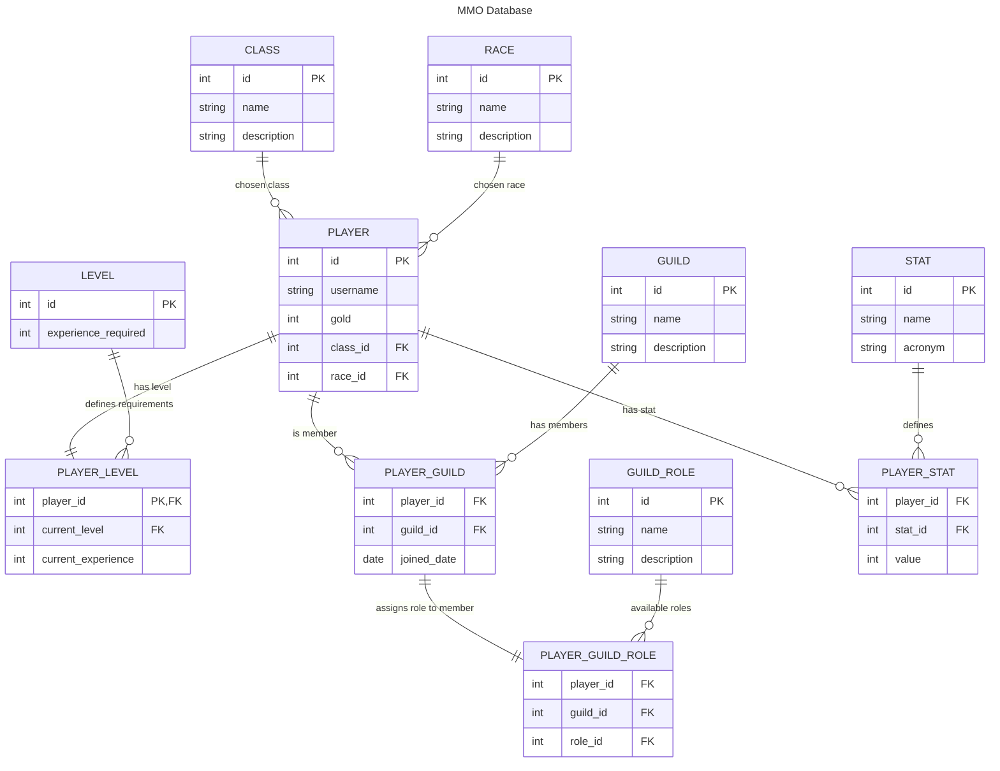

## Setup Instructions

Follow these steps to set up your development environment and run the SQL exercises.

### 1. Install Python

- Make sure Python 3.10 or higher is installed.  
- Check installation:

```bash
python --version
```

- If not installed, download Python from https://www.python.org/downloads/ and follow the instructions for your OS.

### 2. Set up a Virtual Environment
1. Create a virtual environment in your project folder:

```bash
python -m venv .venv
```

2. Activate the virtual environment:

```bash
.venv\Scripts\activate.bat
```

### 3. Install Required Packages
- Make sure you are in the virtual environment.
- Install dependencies from `requirements.txt`:

```bash
pip install -r requirements.txt
```

### Set Up VS Code (Optional but Recommended)
1. Install [Visual Studio Code](https://code.visualstudio.com/)
2. Open the project folder in VS Code.
3. Recommended extensions:
    - Python
    - Jupyter
    - Prettier

