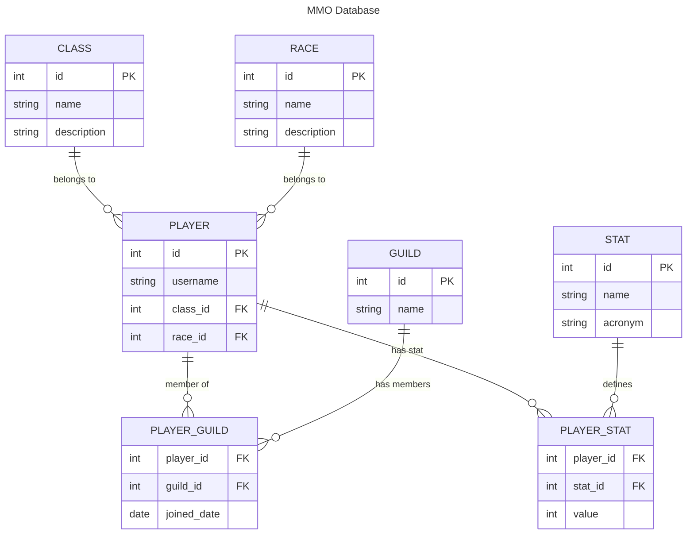

```mermaid
---
title: MMO Database
---
erDiagram
    "CLASS" {
        int id PK
        string name
        string description
    }

    RACE {
        int id PK
        string name
        string description
    }

    PLAYER {
        int id PK
        string username
        int class_id FK
        int race_id FK
    }

    GUILD {
        int id PK
        string name
    }

    PLAYER_GUILD {
        int player_id FK
        int guild_id FK
        date joined_date
    }

    STAT {
        int id PK
        string name
        string acronym
    }

    PLAYER_STAT {
        int player_id FK
        int stat_id FK
        int value
    }

    "CLASS" ||--o{ PLAYER : "belongs to"
    RACE ||--o{ PLAYER : "belongs to"
    PLAYER ||--o{ PLAYER_GUILD : "member of"
    GUILD ||--o{ PLAYER_GUILD : "has members"
    PLAYER ||--o{ PLAYER_STAT : "has stat"
    STAT ||--o{ PLAYER_STAT : "defines"
```